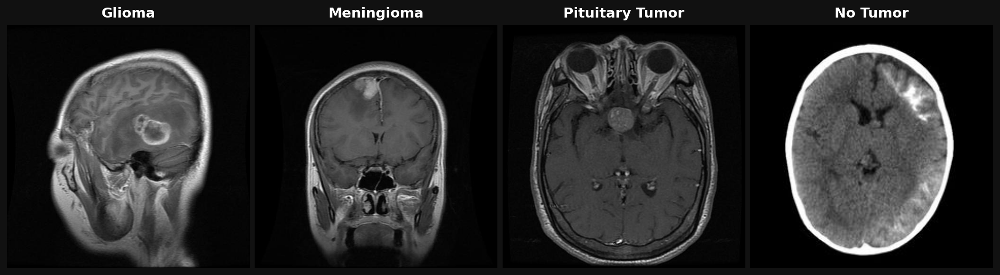
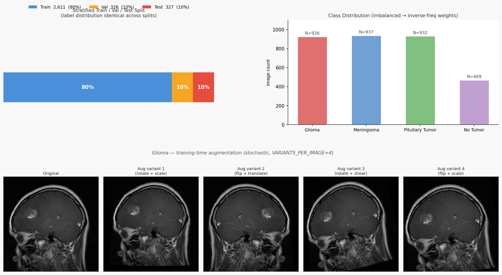
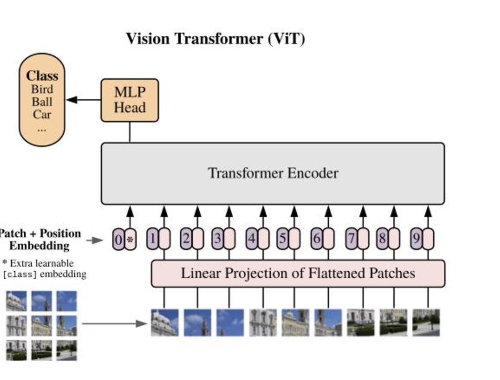
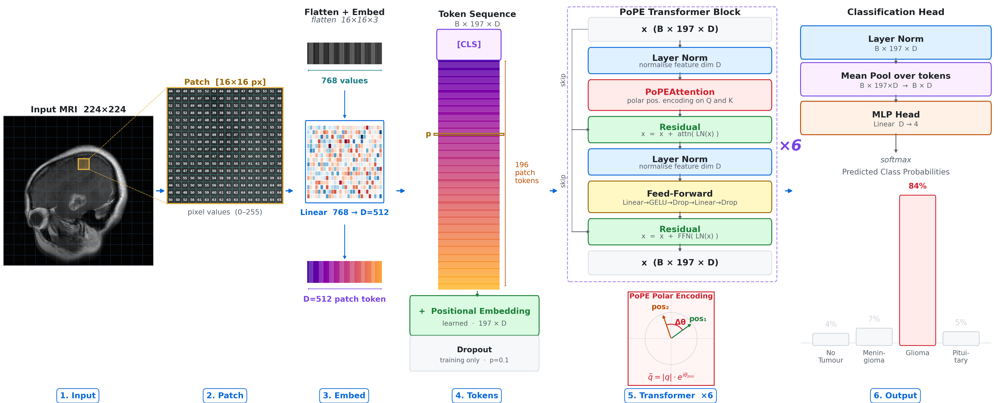
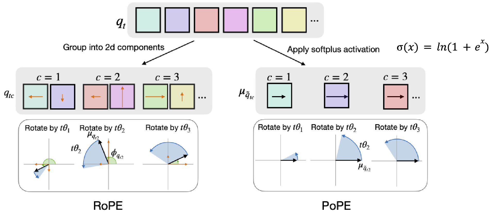
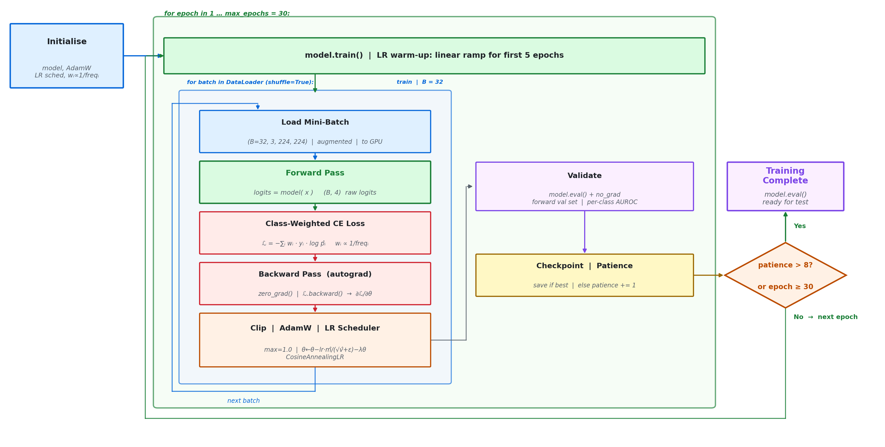
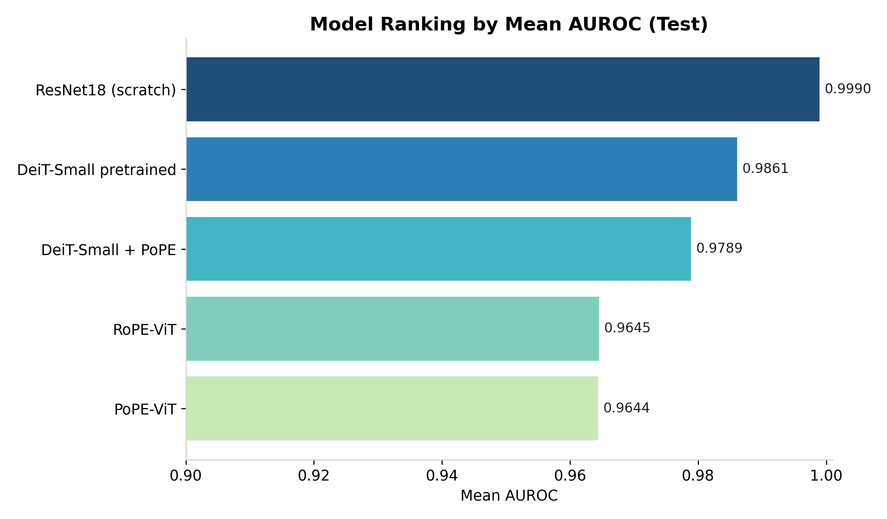
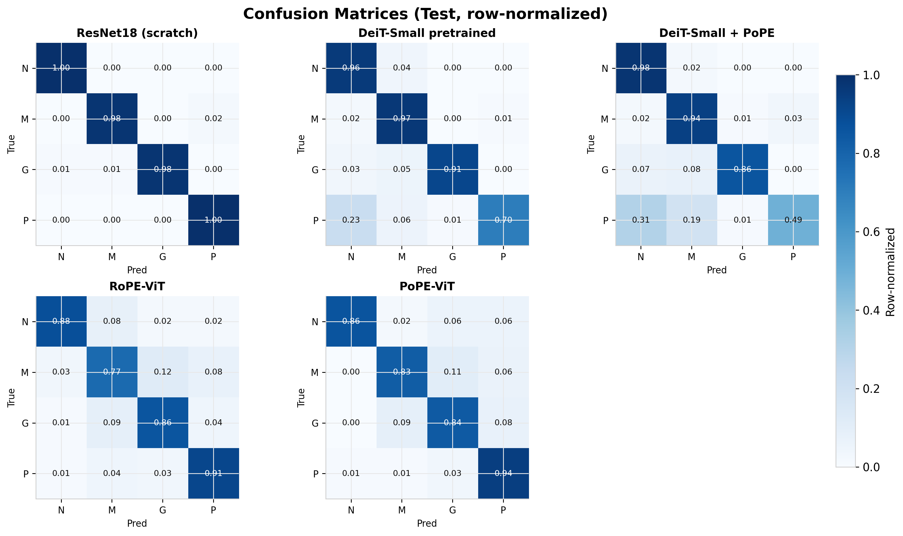

# Brain Tumor Classification with Vision Transformers

### Investigating the Performance of Polar Coordinate Positional Embeddings (PoPE) for Brain Tumor Classification in Vision Transformers

**AML2026 — Group 09**  
Fabio Bucher, Leonard Wagner, Valentina Jordan, Valentina Zingarello

---

## Overview

Brain tumors are among the most serious neurological diseases, where early and accurate diagnosis is critical for patient outcomes. Magnetic Resonance Imaging (MRI) is the current gold standard for brain tumor detection, but manual analysis is challenging and time-consuming.

This project investigates whether **Polar Coordinate Positional Embeddings (PoPE)** — a novel positional encoding mechanism — can improve brain tumor classification in Vision Transformers (ViT). While CNNs have traditionally dominated medical image analysis by capturing local features, Transformers offer large receptive fields and global contextual learning through self-attention mechanisms, enabling them to capture long-range spatial relationships between the tumor and surrounding tissue.

The core research question: **does PoPE's explicit decoupling of "what" (content) from "where" (position) yield better classification than the established RoPE baseline?**

---

## Dataset

We use the publicly available [Brain Tumor Classification (MRI)](https://www.kaggle.com/datasets/sartajbhuvaji/brain-tumor-classification-mri/data) dataset from Kaggle — a heterogeneous collection of MRI scans representative of clinically relevant tumor categories.



| Class | N | Description |
|---|:---:|---|
| **Glioma** | 926 | Diffuse, infiltrative tumor originating from glial cells; irregular borders |
| **Meningioma** | 937 | Tumor arising from the meninges, often spherical and well-defined |
| **Pituitary Tumor** | 932 | Located at the base of the brain in the pituitary gland |
| **No Tumor** | 469 | Healthy brain scans (minority class) |

The dataset contains **3,264 images** in total, with heterogeneous scans varying in shape, tumor location, and growth pattern. The class imbalance (No Tumor at ~469 vs. ~930 for other classes) is addressed via **inverse-frequency class weights** in the loss function.

---

## Data Pipeline & Augmentation

The original train/test folders are **merged and re-split** into stratified train/val/test sets (80/10/10), ensuring label distribution is held identical across all three splits. The test split contains **325 scans**.



**Training transforms (stochastic):**
- `Resize 224×224` — bilinear, antialiased
- `EnsureRGB` — 1-channel → 3-channel, drop alpha
- `RandomAffine` — ±15° rotation · translate 5% · scale 0.95–1.05 · shear 5°
- `RandomHorizontalFlip` — p = 0.5
- `ToDtype float32` — scale to [0, 1]
- `Normalize` — per-split μ and σ

**Val / Test transforms (deterministic):**
- `Resize 224×224` · `EnsureRGB` · `ToDtype float32` · `Normalize`

**Key design choices:**
- Normalization statistics (`μ = 0.1877`, `σ = 0.1778`) computed from the training split only and applied identically to val/test
- Batch size of 32, shuffled training, ordered val/test loaders
- Output tensors: `(B, 3, 224, 224)` float32, normalized

---

## Architecture

### Vision Transformer (ViT)

A Vision Transformer (ViT) performs image classification by treating the image as a sequence of fixed-size patches — similar to how a language model treats a sentence as a sequence of tokens.



*Source: Dosovitskiy et al. (2020). An Image is Worth 16×16 Words.*

The three key steps are:
1. **Reshape** the image into a sequence of flattened 2D patches (16×16 px each)
2. **Add positional embeddings** so the model knows where each patch came from
3. **Feed the `[class]` token embedding** into an MLP head to produce the final class prediction

---

## PoPE Forward Pass — Step by Step

The full forward pass of our PoPE-ViT on a Glioma example:



Each of the 6 steps:

| Step | What happens |
|---|---|
| **1. Input** | A 224×224 MRI scan is loaded as a float32 tensor with 3 channels |
| **2. Patch** | The image is divided into 196 non-overlapping 16×16 pixel patches. Each patch contains 768 raw pixel values (16×16×3) |
| **3. Embed** | Each flattened patch is linearly projected from 768 → D=512, producing one 512-dimensional token per patch |
| **4. Tokens** | A learnable `[CLS]` token is prepended, giving a sequence of 197 tokens (B × 197 × 512). A learned absolute positional embedding (197 × D) is added, followed by dropout (p=0.1) |
| **5. Transformer ×6** | The token sequence passes through 6 stacked PoPE Transformer blocks. Each block applies: LayerNorm → **PoPEAttention** (polar encoding on Q and K) → Residual, then LayerNorm → Feed-Forward → Residual |
| **6. Output** | After the transformer, LayerNorm and mean-pooling over all 197 tokens produce a D-dimensional representation. An MLP head (Linear D→4) followed by softmax outputs 4 class probabilities — in this example, **84% Glioma** |

---

## Positional Embeddings: PoPE vs RoPE

### The Core Idea

Positional embeddings tell the transformer *where* each token (image patch) is located in the sequence. How this position information is encoded — and how cleanly it separates from the token's *content* — is the central design choice we investigate.



*Source: Gopalakrishnan et al. (2025). Decoupling the 'what' and 'where' with polar coordinate positional embeddings.*

### Rotary Position Embeddings (RoPE) — Baseline

In RoPE, query vectors $q_t$ are grouped into 2D components $q_{tc}$ for each component index $c$. Each component is treated as a complex number in polar form $(\mu, \phi)$ and **rotated** by a frequency-scaled position angle $t \cdot \theta_c$. The attention score between positions $t$ and $s$ becomes:

$$a_{ts}^{\text{RoPE}} = \mu_{q_{tc}} \cdot \mu_{k_{sc}} \cdot \cos\!\bigl((s - t)\theta_c + \phi_{k_{sc}} - \phi_{q_{tc}}\bigr)$$

The **problem**: the positional term $(s-t)\theta_c$ is entangled with the content-dependent initial angles $\phi_{q_{tc}}$ and $\phi_{k_{sc}}$. Position similarity and content similarity are conflated — the model cannot independently learn "where" vs "what".

### Polar Coordinate Positional Embeddings (PoPE) — Proposed

PoPE (Gopalakrishnan et al., 2025) fixes this by **zeroing out the initial angles**. Instead of preserving the raw direction of each query component, a softplus activation is applied to extract only the magnitude:

$$\sigma(x) = \ln(1 + e^x)$$

This forces $\phi = 0$, so the attention score simplifies to:

$$a_{ts}^{\text{PoPE}} = \mu_{q_{tc}} \cdot \mu_{k_{sc}} \cdot \cos\!\bigl((s - t)\theta_c\bigr)$$

Now the two terms are cleanly separated:
- $\mu_{q_{tc}} \cdot \mu_{k_{sc}}$ — purely **content** similarity (what does this token represent?)
- $\cos\!\bigl((s-t)\theta_c\bigr)$ — purely **positional** similarity (how far apart are these tokens?)

**Why this matters for medical imaging:** In brain MRI, *where* a structure is located and *what* it looks like carry complementary diagnostic information. Gliomas infiltrate diffusely and can appear anywhere; pituitary tumors are almost always central. PoPE's explicit disentanglement is hypothesized to help the model learn more meaningful representations for distinguishing tumor types by location and appearance independently.

---

## Model Variants

Five configurations are trained and compared end-to-end:

| Model | Description |
|---|---|
| **PoPE-ViT** | Custom ViT trained from scratch with PoPE attention (proposed model) |
| **RoPE-ViT** | Custom ViT trained from scratch with RoPE attention (direct baseline) |
| **DeiT-Small pretrained** | ImageNet-pretrained DeiT-Small, fine-tuned with standard attention |
| **DeiT-Small + PoPE** | Pretrained DeiT-Small with attention layers swapped to PoPEAttention |
| **ResNet18 (scratch)** | CNN baseline trained from scratch for reference |

**Architecture hyperparameters** (custom ViT variants):

| Parameter | Value |
|---|---|
| Image size | 224 × 224 |
| Patch size | 16 px (grid-search best: 8 px) |
| Embedding dim D | 512 |
| Transformer depth | 6 blocks |
| Attention heads | 8 |
| MLP hidden dim | 1024 |
| Dropout | 0.1 |

---

## Training Pipeline



All models are trained with the following setup:

- **Optimizer**: AdamW with $w_i = 1/\text{freq}_i$ class weights (normalized so mean weight = 1)
- **LR schedule**: Cosine annealing with 5-epoch linear warm-up
- **Loss**: Class-weighted cross-entropy — $\mathcal{L} = -\sum_i w_i \cdot y_i \cdot \log p_i$
- **Gradient clipping**: max norm = 1.0
- **Early stopping**: patience of 8 epochs on validation mean AUROC
- **Max epochs**: 30
- **Batch size**: 32
- **Primary metric**: Mean AUROC (one-vs-rest, per class)

Each epoch: load mini-batch → forward pass → weighted CE loss → backward (autograd) → clip → AdamW + CosineAnnealingLR step → validate → checkpoint if best.

---

## Hyperparameter Tuning

A grid search over the custom PoPE-ViT to find optimal settings:

| Hyperparameter | Values Searched | Best |
|---|---|:---:|
| Learning Rate | 1e-4, 3e-4, 1e-3 | **3e-4** |
| Dropout | 0.1, 0.2, 0.5 | **0.1** |
| Patch Size | 8, 16, 32 | **8** |

**Grid Search AUROC Results** (mean AUROC on validation set):

|  | Patch 8 | Patch 16 | Patch 32 |
|---|:---:|:---:|:---:|
| **LR=1e-4, Drop=0.1** | 0.917 | 0.911 | 0.904 |
| **LR=3e-4, Drop=0.1** | **0.963** | 0.927 | 0.920 |
| **LR=1e-3, Drop=0.1** | 0.856 | 0.892 | 0.859 |
| **LR=3e-4, Drop=0.2** | 0.950 | 0.920 | 0.908 |
| **LR=3e-4, Drop=0.5** | 0.837 | 0.855 | 0.847 |

Key findings:
- Performance degrades monotonically as dropout increases 0.1 → 0.5
- `lr=3e-4` consistently outperforms both lower and higher rates
- Patch size 8 wins at the optimal learning rate (AUROC 0.963), though the effect is learning-rate dependent

---

## Results

All models evaluated on the held-out **test split (N = 325)**. Primary metric: **mean AUROC** (one-vs-rest).



### Model Ranking

| Rank | Model | Mean AUROC | Accuracy |
|:---:|---|:---:|:---:|
| 1 | **ResNet18 (scratch)** | **0.9990** | **0.9877** |
| 2 | DeiT-Small pretrained | 0.9861 | 0.8769 |
| 3 | DeiT-Small + PoPE | 0.9789 | 0.7969 |
| 4 | RoPE-ViT | 0.9645 | 0.8523 |
| 5 | PoPE-ViT | 0.9644 | 0.8677 |

### Per-Class AUROC Breakdown

| Model | No Tumor | Meningioma | Glioma | Pituitary | Mean |
|---|:---:|:---:|:---:|:---:|:---:|
| ResNet18 (scratch) | 0.9998 | 0.9997 | 0.9965 | 0.9999 | **0.9990** |
| DeiT-Small pretrained | 0.9813 | 0.9903 | 0.9861 | 0.9867 | 0.9861 |
| DeiT-Small + PoPE | 0.9875 | 0.9736 | 0.9843 | 0.9701 | 0.9789 |
| RoPE-ViT | 0.9961 | 0.9261 | 0.9568 | 0.9791 | 0.9645 |
| PoPE-ViT | 0.9878 | 0.9524 | 0.9438 | 0.9736 | **0.9644** |

### Confusion Matrices



*Row-normalized confusion matrices on the test set. N = No Tumor, M = Meningioma, G = Glioma, P = Pituitary.*

Notable observations:
- **ResNet18** achieves near-perfect classification across all four classes
- **PoPE-ViT** and **RoPE-ViT** are nearly identical on mean AUROC (0.9644 vs 0.9645), suggesting PoPE does not deliver a clear advantage over RoPE when both are trained from scratch
- **Pituitary tumor** is the hardest class for pretrained DeiT variants — DeiT-Small pretrained misclassifies 23% as "No Tumor", and DeiT-Small + PoPE misclassifies 31%; this may reflect that ImageNet pretraining provides little prior for this highly specific anatomy
- **DeiT-Small + PoPE** shows a marked accuracy drop (0.797) relative to the pretrained DeiT baseline (0.877), suggesting the attention-layer swap partially disrupts learned ImageNet representations
- **Meningioma** is the most confused class for scratch-trained ViT variants

---

## Interpretation

**PoPE-ViT vs RoPE-ViT (primary comparison):**
The two custom ViT variants trained from scratch achieve nearly identical mean AUROC (difference < 0.0002). The theoretical advantage of content/position disentanglement in PoPE does not translate into measurable gain at this scale. This may require larger models, larger datasets, or different fine-tuning strategies to manifest.

**Pretraining dominates:**
DeiT-Small pretrained substantially outperforms both scratch-trained ViTs (AUROC 0.986 vs ~0.964), confirming that ImageNet pretraining provides visual representations that transfer well even to grayscale medical images.

**CNN as a strong baseline:**
ResNet18 trained from scratch achieved the best overall results (AUROC 0.9990, accuracy 0.9877), demonstrating that for this dataset size and task, CNNs with strong spatial inductive biases remain highly competitive — and training data efficiency likely favors the CNN.

---

## Limitations

1. **Training from scratch**: The core custom ViT experiments (RoPE-ViT and PoPE-ViT) were trained from scratch rather than initialized from a large-scale pretrained backbone, which limits their final performance. The DeiT + PoPE results suggest the positional encoding swap could be more competitive with a properly pretrained starting point.

2. **Image-level data split**: Multiple MRI slices in the dataset originate from the same patient. Since patient-level identifiers are not provided, the data split was performed at image level — images from the same patient may appear in both training and testing sets, which could lead to optimistic performance estimates.

---

## Repository Structure

```
aml2026-group-09/
├── model.py                       # PoPEViT, RoPEViT, DeiT variants
├── training_pipeline_func.py      # Training loop, TrainingConfig, grid search
├── training_pipeline.ipynb        # Notebook version of training
├── evaluation.py                  # Evaluation: AUROC, confusion matrix
├── BrainTumorDatasetClass.py      # Dataset class with transforms
├── create_train_test_dev_split.py # Stratified dataset splitting
├── label_distribution_sampler.py  # Balanced sampling utility
├── grid_search.py                 # Hyperparameter grid search runner
├── checkpoints/                   # Saved model weights (.pt)
├── results/
│   ├── eval_*.json                # Per-model evaluation outputs
│   └── figures/                   # Result plots (AUROC bars, confusion matrices)
└── figures/                       # Architecture and pipeline diagrams
```

---

## Setup & Usage

**Requirements**: Python 3.10+, PyTorch, timm, einops, scikit-learn, torchvision

```bash
# Install dependencies
uv sync
# or
pip install -r requirements.txt
```

**Dataset**: Download from [Kaggle](https://www.kaggle.com/datasets/sartajbhuvaji/brain-tumor-classification-mri/data) and place at `./Brain-Tumor-Classification-DataSet/`.

```bash
# Create stratified train/val/test split
python create_train_test_dev_split.py

# Train (edit TrainingConfig in training_pipeline_func.py to select model)
python training_pipeline_func.py

# Or use the notebook
jupyter notebook training_pipeline.ipynb

# Evaluate a saved checkpoint
python evaluation.py --model pope_vit --checkpoint checkpoints/pope_vit_best.pt
```

---

## References

- Dosovitskiy, A., et al. (2020). *An Image is Worth 16x16 Words: Transformers for Image Recognition at Scale*. arXiv. https://doi.org/10.48550/ARXIV.2010.11929
- Gopalakrishnan, A., Csordás, R., Schmidhuber, J., & Mozer, M. C. (2025). *Decoupling the 'what' and 'where' with polar coordinate positional embeddings*. arXiv. https://doi.org/10.48550/ARXIV.2509.10534
- Sartaj Bhuvaji et al. *Brain Tumor Classification (MRI)*. Kaggle Dataset. https://www.kaggle.com/datasets/sartajbhuvaji/brain-tumor-classification-mri
