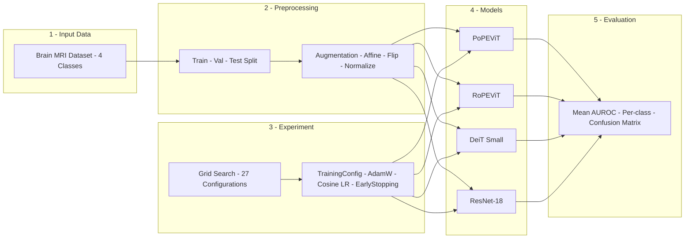

# Diagram 1 - End-to-End Research Pipeline

```mermaid
graph LR
    subgraph input["1 - Input Data"]
        DS["Brain MRI Dataset - 4 Classes"]
    end

    subgraph prep["2 - Preprocessing"]
        SP["Train - Val - Test Split"]
        AUG["Augmentation - Affine - Flip - Normalize"]
    end

    subgraph experiment["3 - Experiment"]
        GS["Grid Search - 27 Configurations"]
        CFG["TrainingConfig - AdamW - Cosine LR - EarlyStopping"]
    end

    subgraph models["4 - Models"]
        P["PoPEViT"]
        R["RoPEViT"]
        D["DeiT Small"]
        C["ResNet-18"]
    end

    subgraph eval["5 - Evaluation"]
        AUC["Mean AUROC - Per-class - Confusion Matrix"]
    end

    DS --> SP --> AUG
    AUG --> P
    AUG --> R
    AUG --> D
    AUG --> C
    GS --> CFG
    CFG --> P
    CFG --> R
    CFG --> D
    CFG --> C
    P --> AUC
    R --> AUC
    D --> AUC
    C --> AUC
```
