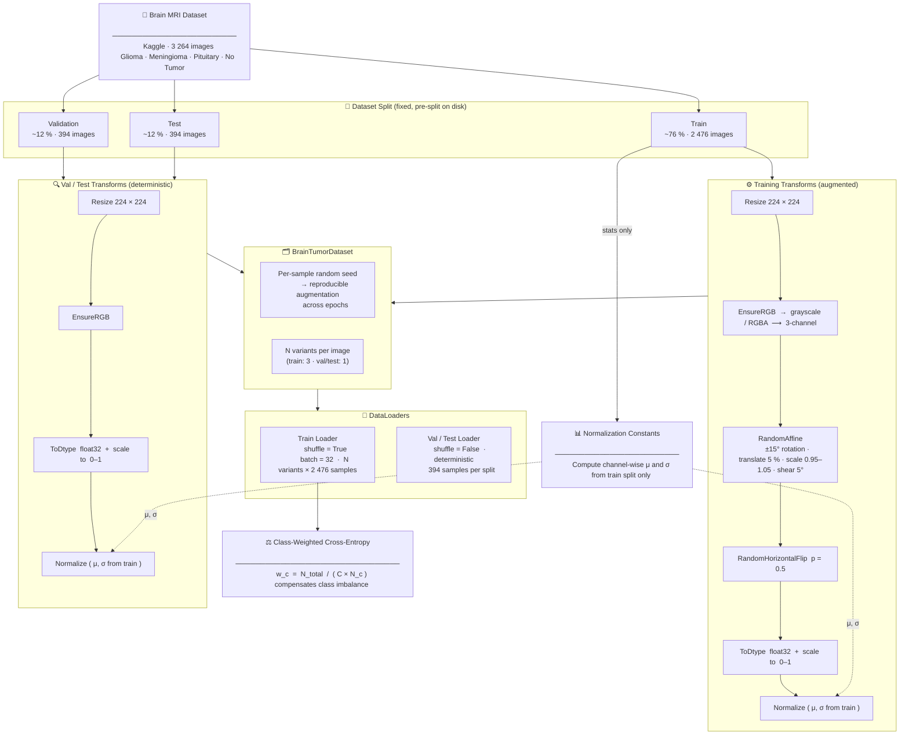

# Diagram 2 — Data Ingestion Pipeline

```mermaid
flowchart TD
    RAW["🧠 Brain MRI Dataset
    ─────────────────────────
    Kaggle · 3 264 images
    Glioma · Meningioma · Pituitary · No Tumor"]

    subgraph split["📂 Dataset Split  (fixed, pre-split on disk)"]
        TR["Train\n~76 %  ·  2 476 images"]
        VA["Validation\n~12 %  ·  394 images"]
        TE["Test\n~12 %  ·  394 images"]
    end

    NC["📊 Normalization Constants
    ─────────────────────────
    Compute channel-wise μ and σ
    from train split only"]

    subgraph train_tf["⚙️ Training Transforms  (augmented)"]
        direction TB
        T1["Resize  224 × 224"]
        T2["EnsureRGB  →  grayscale / RGBA  ⟶  3-channel"]
        T3["RandomAffine
        ±15° rotation · translate 5 % · scale 0.95–1.05 · shear 5°"]
        T4["RandomHorizontalFlip  p = 0.5"]
        T5["ToDtype  float32  +  scale to  0–1"]
        T6["Normalize  ( μ,  σ  from train )"]
        T1 --> T2 --> T3 --> T4 --> T5 --> T6
    end

    subgraph val_tf["🔍 Val / Test Transforms  (deterministic)"]
        direction TB
        V1["Resize  224 × 224"]
        V2["EnsureRGB"]
        V3["ToDtype  float32  +  scale to  0–1"]
        V4["Normalize  ( μ,  σ  from train )"]
        V1 --> V2 --> V3 --> V4
    end

    subgraph dataset["🗂️ BrainTumorDataset"]
        direction LR
        SEED["Per-sample random seed
        → reproducible augmentation
        across epochs"]
        VAR["N variants per image
        (train: 3 · val/test: 1)"]
    end

    subgraph loaders["🚀 DataLoaders"]
        DLtr["Train Loader
        shuffle = True
        batch = 32  ·  N variants × 2 476 samples"]
        DLva["Val / Test Loader
        shuffle = False  ·  deterministic
        394 samples per split"]
    end

    CW["⚖️ Class-Weighted Cross-Entropy
    ─────────────────────────────────
    w_c  =  N_total  /  ( C × N_c )
    compensates class imbalance"]

    RAW --> TR & VA & TE
    TR  -->|"stats only"| NC
    NC  -.->|"μ, σ"| T6
    NC  -.->|"μ, σ"| V4
    TR  --> train_tf
    VA  --> val_tf
    TE  --> val_tf
    train_tf --> dataset
    val_tf   --> dataset
    dataset  --> loaders
    DLtr --> CW
```
