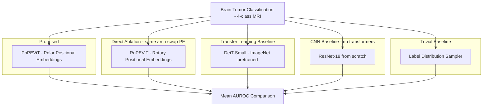

# Diagram 3 - Experiment Design and Baseline Hierarchy

```mermaid
graph TD
    ROOT["Brain Tumor Classification - 4-class MRI"]
    METRIC["Mean AUROC Comparison"]

    subgraph proposed["Proposed"]
        POPE["PoPEViT - Polar Positional Embeddings"]
    end

    subgraph ablation["Direct Ablation - same arch swap PE"]
        ROPE["RoPEViT - Rotary Positional Embeddings"]
    end

    subgraph transfer["Transfer Learning Baseline"]
        DEIT["DeiT-Small - ImageNet pretrained"]
    end

    subgraph cnn["CNN Baseline - no transformers"]
        RES["ResNet-18 from scratch"]
    end

    subgraph trivial["Trivial Baseline"]
        LBL["Label Distribution Sampler"]
    end

    ROOT --> POPE
    ROOT --> ROPE
    ROOT --> DEIT
    ROOT --> RES
    ROOT --> LBL
    POPE --> METRIC
    ROPE --> METRIC
    DEIT --> METRIC
    RES --> METRIC
    LBL --> METRIC
```
