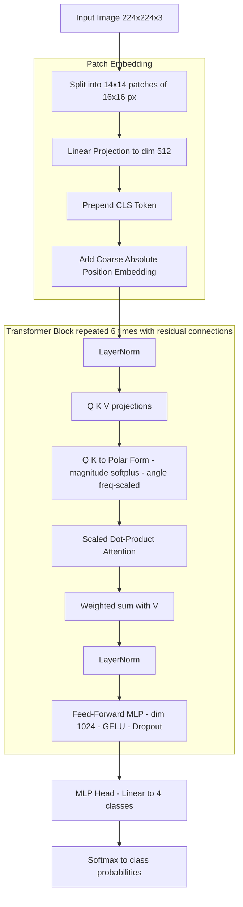

# Diagram 4 - PoPEViT Architecture

```mermaid
graph TD
    IMG["Input Image 224x224x3"]

    subgraph "Patch Embedding"
        PT["Split into 14x14 patches of 16x16 px"]
        PJ["Linear Projection to dim 512"]
        CLS["Prepend CLS Token"]
        APE["Add Coarse Absolute Position Embedding"]
        PT --> PJ --> CLS --> APE
    end

    subgraph "Transformer Block repeated 6 times with residual connections"
        LN1["LayerNorm"]
        QKV["Q K V projections"]
        POL["Q K to Polar Form - magnitude softplus - angle freq-scaled"]
        SC["Scaled Dot-Product Attention"]
        WV["Weighted sum with V"]
        LN2["LayerNorm"]
        FF["Feed-Forward MLP - dim 1024 - GELU - Dropout"]
        LN1 --> QKV --> POL --> SC --> WV --> LN2 --> FF
    end

    HEAD["MLP Head - Linear to 4 classes"]
    SOFT["Softmax to class probabilities"]

    IMG --> PT
    APE --> LN1
    FF --> HEAD --> SOFT
```
