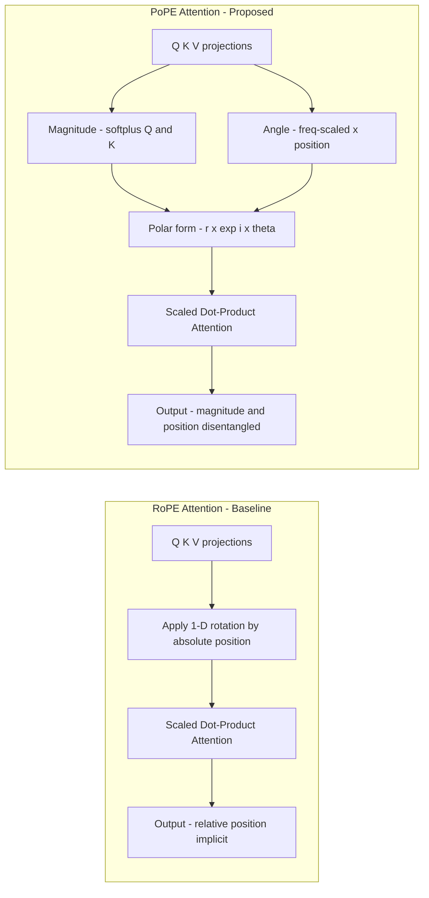

# Diagram 5 - PoPE vs RoPE Attention

```mermaid
graph LR
    subgraph "RoPE Attention - Baseline"
        QKV_R["Q K V projections"]
        ROT["Apply 1-D rotation by absolute position"]
        ATT_R["Scaled Dot-Product Attention"]
        O_R["Output - relative position implicit"]
        QKV_R --> ROT --> ATT_R --> O_R
    end

    subgraph "PoPE Attention - Proposed"
        QKV_P["Q K V projections"]
        MAG["Magnitude - softplus Q and K"]
        ANG["Angle - freq-scaled x position"]
        POL["Polar form - r x exp i x theta"]
        ATT_P["Scaled Dot-Product Attention"]
        O_P["Output - magnitude and position disentangled"]
        QKV_P --> MAG
        QKV_P --> ANG
        MAG --> POL
        ANG --> POL
        POL --> ATT_P --> O_P
    end
```
