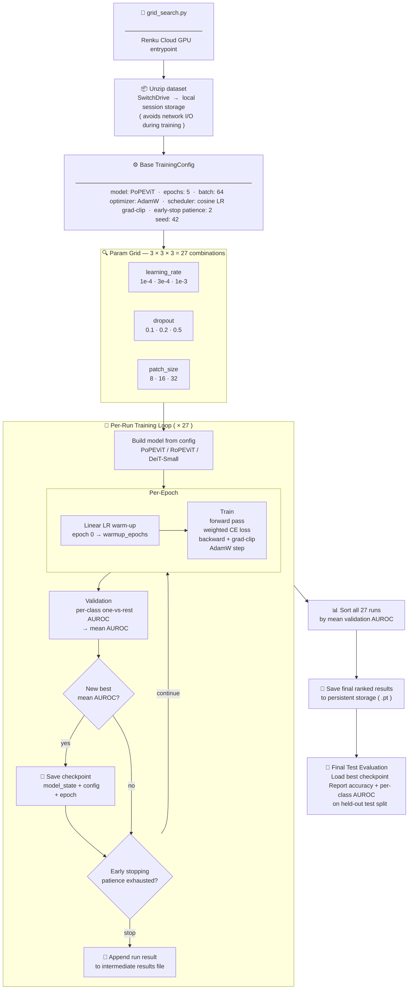

# Diagram 6 — Training Pipeline & Grid Search

```mermaid
flowchart TD
    EP["🚀 grid_search.py
    ──────────────────
    Renku Cloud GPU entrypoint"]

    UZ["📦 Unzip dataset
    SwitchDrive  →  local session storage
    ( avoids network I/O during training )"]

    BASE["⚙️ Base TrainingConfig
    ─────────────────────────────────────────
    model: PoPEViT  ·  epochs: 5  ·  batch: 64
    optimizer: AdamW  ·  scheduler: cosine LR
    grad-clip  ·  early-stop patience: 2
    seed: 42"]

    subgraph grid["🔍 Param Grid  —  3 × 3 × 3 = 27 combinations"]
        direction LR
        LR["learning_rate
        1e-4 · 3e-4 · 1e-3"]
        DR["dropout
        0.1 · 0.2 · 0.5"]
        PS["patch_size
        8 · 16 · 32"]
    end

    subgraph run["🔁 Per-Run Training Loop  ( × 27 )"]
        direction TB
        BM["Build model from config
        PoPEViT / RoPEViT / DeiT-Small"]

        subgraph epoch["Per-Epoch"]
            direction LR
            WU["Linear LR warm-up
            epoch 0 → warmup_epochs"]
            TR["Train
            forward pass
            weighted CE loss
            backward + grad-clip
            AdamW step"]
            WU --> TR
        end

        VL["Validation
        per-class one-vs-rest AUROC
        → mean AUROC"]

        CK{"New best
        mean AUROC?"}

        SV["💾 Save checkpoint
        model_state + config + epoch"]

        ES{"Early stopping
        patience exhausted?"}

        IR["📄 Append run result
        to intermediate results file"]

        BM --> epoch --> VL --> CK
        CK -->|yes| SV --> ES
        CK -->|no| ES
        ES -->|continue| epoch
        ES -->|stop| IR
    end

    SORT["📊 Sort all 27 runs
    by mean validation AUROC"]

    SAVE["💾 Save final ranked results
    to persistent storage  ( .pt )"]

    TEST["🧪 Final Test Evaluation
    Load best checkpoint
    Report accuracy + per-class AUROC
    on held-out test split"]

    EP --> UZ --> BASE
    BASE --> grid
    grid --> BM
    run  --> SORT --> SAVE --> TEST
```
